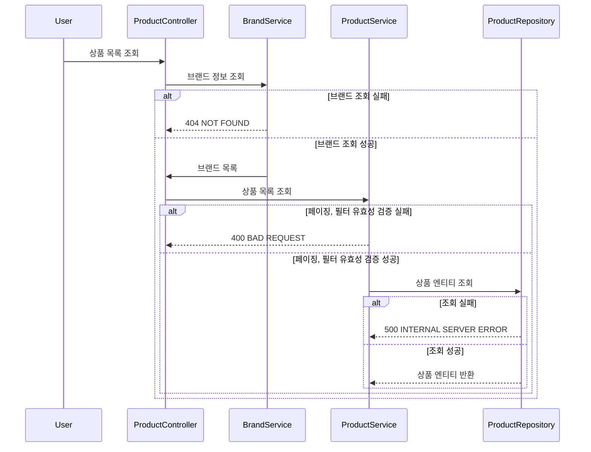
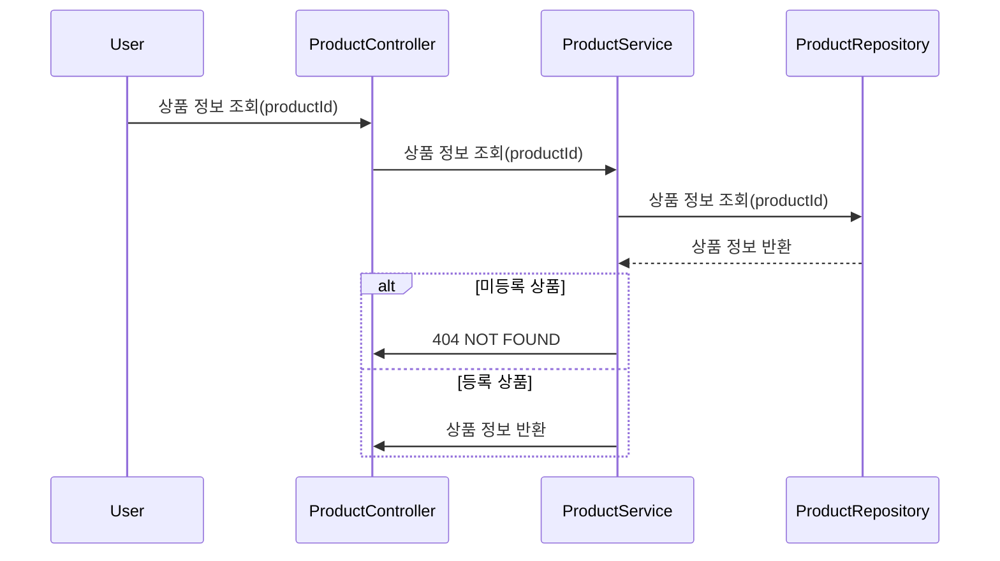
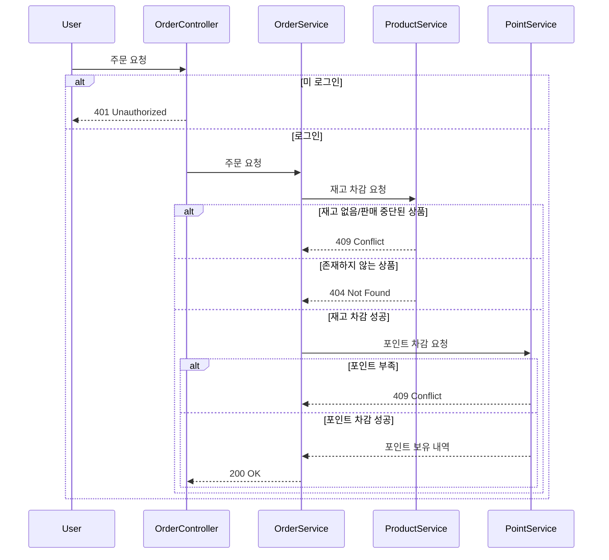

# Sequence Diagrams

## 1. 상품(Product) 도메인

### 1.1. 상품 목록 조회

### 1.2. 상품 정보 조회

## 2. 브랜드(Brand) 도메인

### 2.1. 브랜드 정보 조회

## 3. 좋아요

### 3.1. 상품 좋아요 등록

### 3.2. 상품 좋아요 취소

### 3.3. 내가 좋아요 한 상품 목록 조회

## 4. 주문(Order) 도메인

### 4.1. 주문 요청

### 4.2. 주문 목록 조회

### 4.3. 단일 주문 상세 조회
