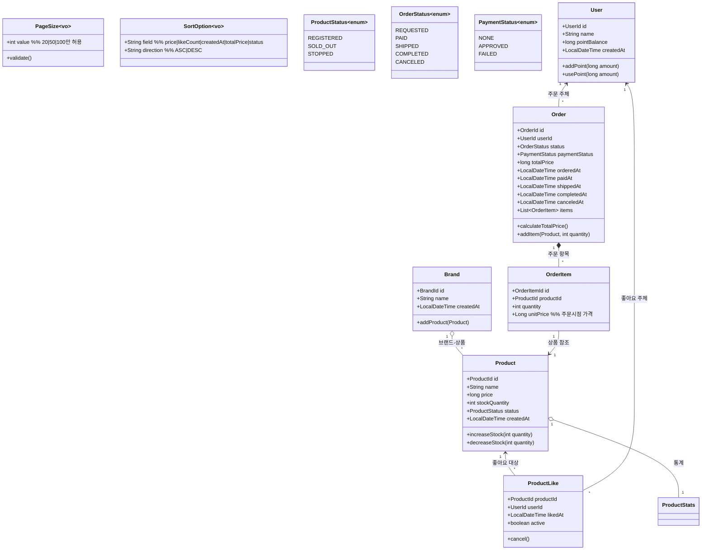

# Class Diagrams

```mermaid
classDiagram
%% ===================== VO =====================
class PageSize ~vo~ {
+int value   %% 20|50|100만 허용
+validate()
}

    class SortOption ~vo~ {
        +String field   %% price|likeCount|createdAt|totalPrice|status
        +String direction %% ASC|DESC
    }

    %% ===================== ENUM =====================
    class ProductStatus ~enum~ {
        REGISTERED
        SOLD_OUT
        STOPPED
    }

    class OrderStatus ~enum~ {
        REQUESTED
        PAID
        SHIPPED
        COMPLETED
        CANCELED
    }

    class PaymentStatus ~enum~ {
        NONE
        APPROVED
        FAILED
    }

    %% ===================== Entity =====================
    class User {
        +UserId id
        +String name
        +long pointBalance
        +addPoint(long amount)
        +usePoint(long amount)
        +LocalDateTime createdAt
    }

    class Brand {
        +BrandId id
        +String name
        +LocalDateTime createdAt
        +addProduct(Product)
    }

    class Product {
        +ProductId id
        +String name
        +long price
        +int stockQuantity
        +ProductStatus status
        +LocalDateTime createdAt
        +increaseStock(int quantity)
        +decreaseStock(int quantity)
    }


    class ProductLike {
        +ProductId productId
        +UserId userId
        +LocalDateTime likedAt
        +boolean active
        +cancel()
    }

    class Order {
        +OrderId id
        +UserId userId
        +OrderStatus status
        +PaymentStatus paymentStatus
        +long totalPrice 
        +LocalDateTime orderedAt
        +LocalDateTime paidAt
        +LocalDateTime shippedAt
        +LocalDateTime completedAt
        +LocalDateTime canceledAt
        +List~OrderItem~ items
        +calculateTotalPrice()
        +addItem(Product, int quantity)
    }

    class OrderItem {
        +OrderItemId id
        +ProductId productId
        +int quantity
        +Long unitPrice %% 주문시점 가격
    }


    %% ===================== 관계 =====================
    Brand "1" o-- "*" Product : 브랜드-상품
    Product "1" o-- "1" ProductStats : 통계
    Product "1" <-- "*" ProductLike : 좋아요 대상
    User "1" <-- "*" ProductLike : 좋아요 주체

    Order "1" *-- "*" OrderItem : 주문 항목
    OrderItem "1" --> "1" Product : 상품 참조

    User "1" <-- "*" Order : 주문 주체
```