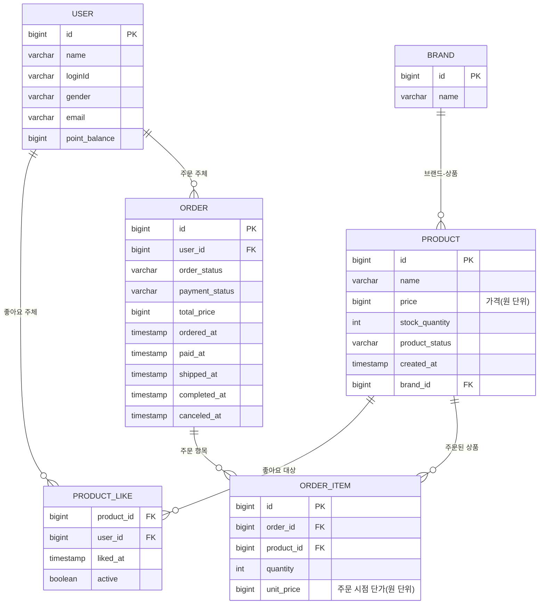

# erd

```mermaid
erDiagram
%% ===================== 엔티티 =====================

    USER {
        bigint id PK
        varchar name
        varchar loginId
        varchar gender
        varchar email
        bigint point_balance 
    }

    BRAND {
        bigint id PK
        varchar name
    }

    PRODUCT {
        bigint id PK
        varchar name
        bigint price "가격(원 단위)"
        int stock_quantity
        varchar product_status
        timestamp created_at
        bigint brand_id FK 
    }

    PRODUCT_LIKE {
        bigint product_id FK
        bigint user_id FK
        timestamp liked_at
        boolean active
        %% (product_id, user_id) UNIQUE 제약
    }

    ORDER {
        bigint id PK
        bigint user_id FK
        varchar order_status
        varchar payment_status
        bigint total_price
        timestamp ordered_at
        timestamp paid_at
        timestamp shipped_at
        timestamp completed_at
        timestamp canceled_at
    }

    ORDER_ITEM {
        bigint id PK
        bigint order_id FK
        bigint product_id FK 
        int quantity
        bigint unit_price "주문 시점 단가(원 단위)"
    }

    %% ===================== 관계 =====================

    BRAND ||--o{ PRODUCT : "브랜드-상품"
    USER  ||--o{ PRODUCT_LIKE : "좋아요 주체"
    PRODUCT ||--o{ PRODUCT_LIKE : "좋아요 대상"

    USER  ||--o{ ORDER : "주문 주체"
    ORDER ||--o{ ORDER_ITEM : "주문 항목"
    PRODUCT ||--o{ ORDER_ITEM : "주문된 상품"
```